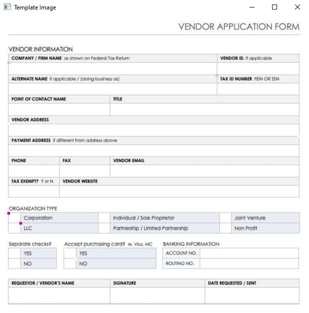

# OCR-openCV-pytesseract
Simple OCR which performs the NLP task using openCV and pytesseract to extract the text and other informations from any kind of forms.

## Working
Initially any kind of forms needs to be converted into image. Then we have the specify the region of interests means locating the interested regions on the image from where we tend to get the information. For this we will make use of below python script.

### bbox.py
This python script is used to get the bounding box information from the template image. Here template image is used as referencing image. We have to the mark the regions using the mouse. After marking the region it will ask for type and name of the region. To make sure the same region is not marked again the marked points will be coloured after marking.

Below image shows the marked regions.



We have to provide the type and name of the regions during execution.

```
Enter Type text

Enter Name Company_name

Enter Type text

Enter Name Vendor_Address

Enter Type box

Enter Name Corporation

Enter Type box

Enter Name card_yes
```

This is the output we get after execution. This simply represent the bounding box information.

```
[[(36, 190), (870, 240), 'text', 'Company_name'],
 [(36, 434), (1200, 484), 'text', 'Vendor_Address'],
 [(36, 792), (84, 832), 'box', 'Corporation'],
 [(258, 930), (306, 974), 'box', 'card_yes']]
```
## ocr.py

In this python script the actual extraction of informations from the image takes place.

step 1: Importing the necessary packages and template image and providing bounding box information.

step 2: Finding the keypoints and descriptors of the template image using ORB detector.

step 3: Importing the testing images.

step 4: Finding the keypoints and descriptors of the testing images using ORB detector and matching the descriptors using brute force matcher.

step 5: Matching the descriptors of template image and testing images.

step 6: Aligning the images it wont make much difference in testing images if it is already aligned.

step 7: Masking the region of interests.

step 8: Cropping the region of interests.

step 9: Checks the type of the region. <br>
        
        * If the type is text
            pytesseract converts the image to string using inbuilt function image_to_string.
            
        * If the type is box
            Converts the image into grayscale and then converts it into binary image where foreground and background gets seperated.
            Counting the non zero pixels of the cropped image.
            If the count is greater than the set threshold value
                then box is checked
            else
                box is unchecked
         
## Data.csv    
step 10: Storing the data in .csv file. 

